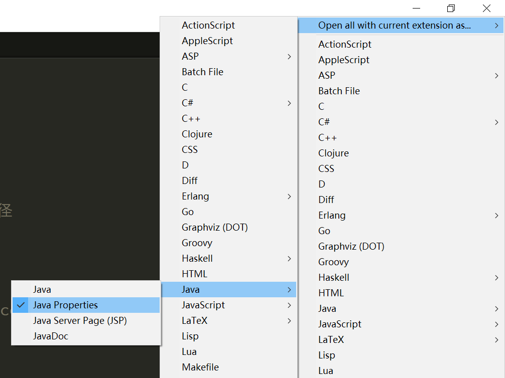
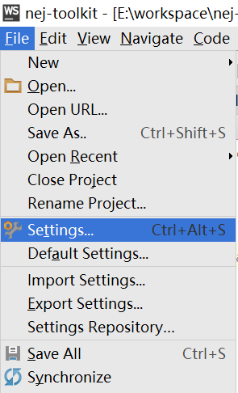
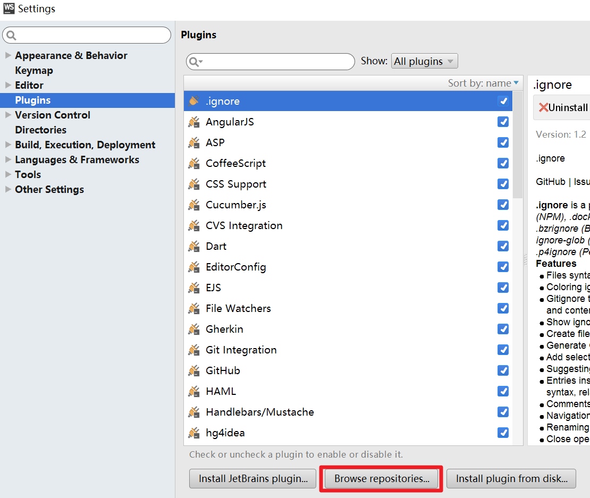
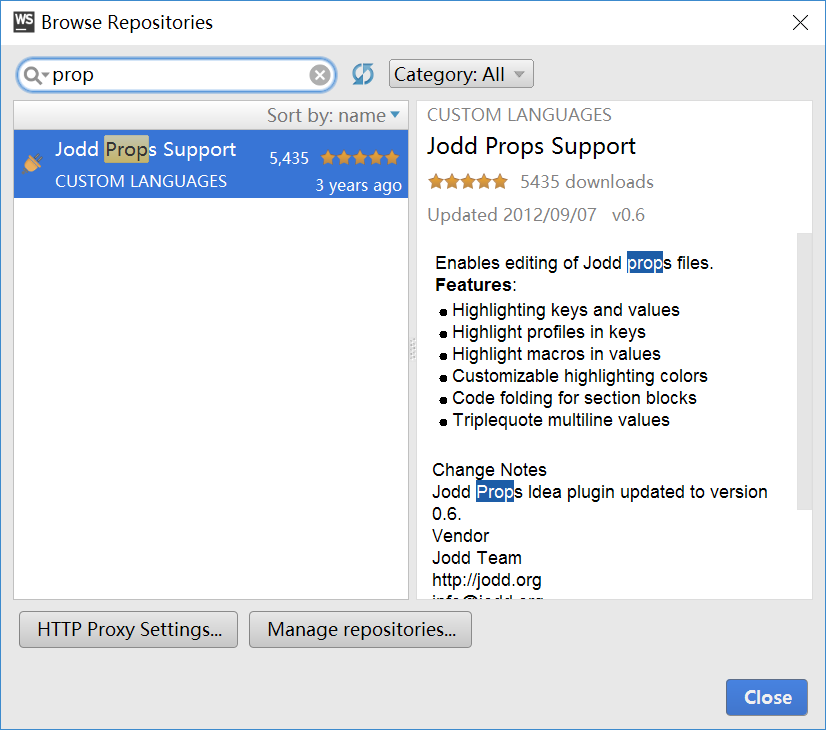

# 工具简介

本工具提供了项目前端代码的优化输出和自动化发布功能，本工具的主要特性有：
* 通过配置控制打包输出，降低了对原有系统的侵入性
* 支持使用html注释标记来控制打包输出，增加了打包的灵活性
* 支持非NEJ项目智能识别，并优化输出结果
* 支持采用[NEJ依赖管理系统](https://github.com/genify/nej/blob/master/doc/DEPENDENCY.md)的项目，并分离NEJ依赖系统
* 支持[NEJ平台适配系统](https://github.com/genify/nej/blob/master/doc/PLATFORM.md)，并按平台配置选择性输出内容
* 支持SourceMap输出，增加测试环境可调试性

# 工具使用

## 环境配置
发布工具基于[nodejs](http://nodejs.org/)平台，因此需要使用者先安装nodejs环境，[nodejs](http://nodejs.org/)在各平台下的安装配置请参阅官方说明。

注：打包工具从1.0.0版本之后，需要nodejs在0.12.x以上的版本

## 使用说明
1.  执行以下命令安装打包工具，如果已安装打包工具可忽略此步骤

    ```bash
    npm install nej –g
    ```

    如果已安装过打包工具，则可以使用以下命令更新打包工具至最新版本

    ```bash
    npm update nej –g
    ```
    
2.  执行以下命令初始化打包配置文件，命令后面可输入配置文件输出路径，默认输出在当前目录，此时会在指定目录或者当前目录生成一个release.conf文件用来配置打包选项

    ```bash
    nej init
    ```

    ```bash
    nej init /path/to/deploy/dir/
    ```
    
3.  按照项目的实际情况修改配置文件release.conf，具体参数见手册配置参数章节
4.  执行以下命令打包项目，如果release.conf文件在当前目录也可不指定

    ```bash
    nej build
    ```

    ```bash
    nej build /path/to/release.conf
    ```

## 参考手册

打包标记说明见[wiki](./doc/Manual/TAG.md)

配置参数说明见[wiki](./doc/Manual/Config.md)

# 指令说明

本工具使用时在终端或者命令行输入以下格式指令运行

```bash
nej [指令] [参数]
```

其中可用的指令包括：

| 指令  | 描述 |
| :--- | :--- |
| init   | 创建release.conf配置文件 |
| build  | 根据release.conf配置文件发布项目 |
| export | 导出指定脚本文件列表 |

其中针对nej可用的参数包括：

| 简写 | 全称 | 描述 |
| :--- | :--- | :--- |
| -v | --version | 显示工具版本信息 |
| -h | --help    | 显示指定命令的帮助信息 |

使用范例：

查看工具版本信息

```bash
nej -v
```

显示工具帮助信息

```bash
nej -h
```

查看build指令帮助信息

```bash
nej build -h
```

## init

在指定目录下输出release.conf文件模板，后续可在此基础上调整配置参数，指令的运行格式为：

```bash
nej init [目录] [参数]
``` 

其中 [目录] 为配置文件的输出目录，相对路径相对于当前执行命令的目录，默认在当前目录下输出

针对 nej init 指令可用的参数包括：

| 简写 | 全称 | 描述 |
| :--- | :--- | :--- |
| -h | --help    | 显示 init 命令的帮助信息 |

使用范例：

在当前目录下生成 release.conf 文件

```bash
nej init
``` 

在 /path/to/output/ 下输出 release.conf 文件

```bash
nej init /path/to/output/
``` 

## build

使用指定的配置文件打包项目，指令的运行格式为：

```bash
nej build [配置文件] [参数]
``` 

其中 [配置文件] 为通过 "nej init" 生成的项目配置文件路径

针对 nej build 指令可用的参数包括：

| 简写 | 全称 | 描述 |
| :--- | :--- | :--- |
| -h | --help  | 显示 build 命令的帮助信息 |
| -m | --mode  | 发布模式，此优先级高于配置文件中X_RELEASE_MODE配置的优先级，默认为online |
| -l | --level | 日志级别，此优先级高于配置文件中X_LOGGER_LEVEL配置的优先级，可用值：debug,info,warn,error,all,off，默认为all |

使用范例：

通过当前目录下的 release.conf 文件发布项目

```bash
nej build
``` 

使用 /path/to/release.conf 配置文件发布项目，并使用 test 模式，仅输出 warn/error 的日志

```bash
nei build /path/to/release.conf -m test -l warn
```

## export

导出指定的脚本文件列表，多个脚本用逗号分隔，指令的运行格式为：

```bash
nej export <脚本列表> [参数]
``` 

其中 <脚本列表> 为脚本路径的列表，支持多个脚本文件输入，脚本文件之间使用逗号分隔，脚本文件路径支持NEJ依赖系统规范，支持NEJ依赖分析

**注意：脚本路径中出现的 “&” 符号因为是命令行关键字，需使用 “%26” 代替**

针对 nei export 指令可用的参数包括：

| 简写 | 全称 | 描述 |
| :--- | :--- | :--- |
| -h | --help    | 显示 update 命令的帮助信息 |
| -o | --output  | 指定导出脚本文件的路径，相对路径相对于当前目录，默认在当前目录生成output.js文件 |

可扩展的配置参数，后续根据实际需求扩展

| 简写 | 全称 | 描述 |
| :--- | :--- | :--- |
| 无 | --charset | 文件输入输出编码，默认utf-8 |
| 无 | --dropconsole | 输出代码是否删除console相关日志输出代码，默认不删除 |
| 无 | --codeWrap | 输出代码包装语句，其中%s表示输出代码，默认为 %s |

使用范例：

导出当前目录下的 a.js和b.js 输出到 /path/to/min.js

```bash
nej export ./a.js,./b.js -o /path/to/min.js
``` 

导出NEJ模块到 /path/to/app.min.js 文件

```bash
nej export /path/to/nej/define.js?pro=./src/%26com=./src/common/,util/ajax/xdr,./app.js -o /path/to/app.min.js
```

# 常见问题

## Q1

Q：如何在非NEJ项目中使用打包工具？

A：

1. 使用nej init生成配置文件
2. 修改配置参数，[参数说明](./doc/Manual/CONFIG.md)
3. 使用nej build打包

如果需要指定打完包后的样式/脚本插入位置，则可以在页面中增加 style 和 script 打包标记，[标记说明](./doc/Manual/TAG.md)，如果使用自动处理可忽略，自动处理时插入点为第一个参与打包资源的位置

```html
<html>
  <head>

    ...

    <!-- 在要打包后插入样式的位置加入style标记 -->

    <!-- @style -->
    <link href="/src/css/a.css" .../>

    ...

  </head>
  <body>

    ...

    <!-- 在要打包后插入脚本的位置加入script标记 -->

    <!-- @script -->
    <script src="/src/js/a.js"></script>
    <script src="/src/js/b.js"></script>
    <script src="/src/js/c.js"></script>
    <script src="/src/js/d.js"></script>
    <script src="/src/js/e.js"></script>

    ...

  </body>
</html>
```


## Q2

Q：服务器模版项目中如何使用打包工具？

以freemarker为例，其他模版类似

原先core脚本配置文件core.js.ftl

```html
<#macro coreJS>
<script src="/src/js/a.js"></script>
<script src="/src/js/b.js"></script>
<script src="/src/js/c.js"></script>
<script src="/src/js/d.js"></script>
<script src="/src/js/e.js"></script>
<script src="/src/js/f.js"></script>
</#macro>
```

原先页面入口模版page.ftl

```html
<@coreJS/>
<script src="/src/js/pg/a.js"></script>
<script src="/src/js/pg/b.js"></script>
<script src="/src/js/pg/c.js"></script>
```

A：采用打包配置方式来实现

方式一：在打包配置文件中打开 CORE_LIST_JS 配置参数，并将core.js.ftl中的js文件列表配置在该参数中

```js
CORE_LIST_JS = ['/src/js/a.js','/src/js/b.js','/src/js/c.js','/src/js/d.js','/src/js/e.js','/src/js/f.js']
```

方式二：合并策略开关 CORE_MERGE_FLAG 设置为 2 或者 3，让每个页面的脚本单独分析

```bash
CORE_MERGE_FLAG = 2
```


## Q3

Q：如何在使用RequireJS加载器的项目中使用打包工具？

A：可以按照以下步骤对RequireJS项目做打包输出

1. 对页面引入的requirejs脚本增加noparse标记

    ```html
    <!-- @noparse -->
    <script data-main="scripts/main" src="scripts/require.js"></script>
    <!-- /@noparse -->
    ```

2. 配置打包参数 CORE_NOPARSE_FLAG 为2，不对内联脚本做任何解析

    ```js
    CORE_NOPARSE_FLAG = 2
    ```

3. 使用RequireJS的打包工具r.js对项目进行打包输出
4. 针对输出结果配置打包参数，包括输入输出配置等
5. 执行打包命令对样式和静态资源等内容做优化输出


## Q4

Q：如何在代码中植入调试信息

A：编码时使用DEBUG标识区分开发调试代码片段

```javascript

var a = 'aaaaa';

if (DEBUG){
    
    // 这里的代码片段在打包发布时会自动删除
    console.log('info for test');
    
}

// TODO something

```

## Q5

Q：为什么我在windows、mac系统下用nej build可以正常打包，但是在linux下打包会报JS语法错误

A：这种情况下多半是因为你依赖的文件路径名称中有大小写搞错了，你可以根据提示在打包配置文件下找到出异常的JS文件，然后找到对应行看一下出错的文件路径是什么，比如以下打包异常提示

```bash
[E] 2016-03-01 17:05:12.076 - js code parse error for pp_app.js, source code in pp_app.js, exception information :
Unexpected token: name (read) at line 55 col 5
```

则可以在release.conf文件所在的目录下找到 pp_app.js 文件，查看第55行查看异常信息，如

```javascript
55： cant read file E:/workspace/nej-toolkit/test/cases/abort/webapp/src/javascript/not/exist.js for utf-8, cause:
56： {"errno":-4058,"code":"ENOENT","syscall":"open","path":"E:\\workspace\\nej-toolkit\\test\\cases\\abort\\webapp\\src\\javascript\\not\\exist.js"}
```

## Q6

Q：如何用 Sublime Text 优雅的查看配置文件

A：使用 Sublime Text 打开配置文件，点击编辑器右下角，选择始终使用 Java -> Java Properties 语法高亮该扩展名的配置文件，如下图所示



## Q7

Q：如何用 WebStorm 优雅的查看配置文件

A：使用 WebStorm 的 Jodd Props 插件来查看，具体操作步骤如下图所示

1. 在菜单 File -> Settings 中打开 WebStorm 的配置

    

2. 在设置窗口左侧中找到 Plugins 菜单项，点击 Browse repositories... 按钮

    

3. 在搜索框里输入 prop 关键字搜索插件，并安装找到的插件

    

4. 重启 WebStorm

5. 在菜单 File -> Settings 中打开 WebStorm 的配置，并选择左侧的 Editor -> File Types 选项，找到 Jodd Props 文件类型，并将 \*.conf 添加到此文件类型的识别规则中

    

# 版本历史

## 1.4.0   (2016-05-24)

* define增加nej标识，通过define.nej识别是否NEJ提供的define函数

## 1.3.9   (2016-05-12)

* 一个页面中增加多个 @template 标记支持

## 1.3.8   (2016-04-12)

* 修正样式中url()地址带引号的异常（https://github.com/genify/toolkit2/issues/2）

## 1.3.7   (2016-03-09)

* 支持页面 MERGE 标记，支持 name/minify 配置参数
* 增加NEJ模块根路径日志输出

## 1.3.5   (2016-02-23)

* 调整样式中静态资源路径识别策略，对于非DIR_STATIC下的静态资源由原来的忽略改成输出WARN日志

## 1.3.4   (2016-02-16)

* 修正 export 命令行 & 关键字处理

## 1.3.3   (2016-02-03)

* 修正 media query 中静态资源路径和版本未调整的异常
    
## 1.3.2   (2016-02-01)

* 修正 NEJ.define 依赖远程路径时URL的解析错误
* IGNORE 标记增加反模式匹配规则，如 !online
* 修正混淆级别为 3 时，下划线开始的对象属性在字符串中的变量名被混淆的bug
* 修正代码 nej export 导出冗余代码的bug

## 1.3.0   (2016-01-27)

* 增加 WRP_INLINE_STYLE/WRP_EXLINE_STYLE/WRP_INLINE_SCRIPT/WRP_EXLINE_SCRIPT 配置支持
* 增加打开 X_AUTO_EXLINK_SCRIPT 开关时，处理不参与脚本合并的代码中的资源路径和版本的调整
* 增加 DIR_OUTPUT 配置上的变量支持
* 修正 style/script/textarea 标签内的 ignore 标记失效问题

## 1.2.8   (2016-01-12)

* 优化参数解析方式
* 命令行增加发布模式配置支持
* 命令行增加日志级别配置支持

## 1.2.7   (2015-10-23)

* 增加X_AUTO_EXLINK_SCRIPT配置参数支持脚本中静态资源路径解析

## 1.2.6   (2015-10-12)

* 修正标签解析时属性“=”前后带空格的异常
* 调整全局变量配置的优先级

## 1.2.5   (2015-09-23)

* 修改脚本默认混淆级别为0
* noparse标签内的静态资源解析
* 模块版本输出时过滤模板文件

## 1.2.4   (2015-09-18)

* 修正代码中#<uispace>打包异常

## 1.2.3   (2015-09-15)

* 修正样式中部分静态资源路径未调整异常

## 1.2.2   (2015-09-08)

* NEJ模块内联模板不使用WRP_INLINE_SOURCE配置包装
* 输入目录存在包含关系给出警告提示
* 增加FILE_EXCLUDE配置参数支持
* 修正插件解析的html文件被作为输入文件时的异常
* 修正模板内联脚本出现包装结束节点的异常
* 修正标签属性为空的情况下输出异常

## 1.1.8   (2015-08-28)

* 增加页面压缩配置参数支持 CPRS_FLAG/CPRS_KEEP_COMMENT
* 修正标签换行异常

## 1.1.6   (2015-08-26)

* 修正NEJ模板中静态资源加版本号异常
* 修正样式背景图静态志愿

## 1.1.4   (2015-08-11)

* 移除NEI构建工具相关内容

## 1.1.3   (2015-08-04)

* 调整webapp项目输出结构
* 增加puer配置输出

## 1.1.1   (2015-07-31)

* 调整NEJ define.js替换规则
* 增加npmignore文件忽略安装测试用例
* 支持nej export指令
* 支持NEJ模块单独导出

## 1.0.8   (2015-07-30)

* 支持NEJ源码二次包装
* 修正mac下路径多次补全问题
* 修正define.js路径上配置信息读取异常

## 1.0.5   (2015-07-27)

* 支持老版本针对Opera的Patcher
* 修正define依赖列表中带版本号无法识别路径问题
* 样式解析异常时采用字符串匹配方式调整资源路径

## 1.0.3   (2015-07-24)

* 修正函数参数、返回结果识别
* 修正发布过程出现error错误没有退出流程
* 构建工具对接NEI平台接口

## 1.0.0   (2015-07-21)

* 工具整体重构
* 增加HTML标签解析
* 精简/合并配置参数

## 0.5.6   (2015-04-17)

* NAME_SUFFIX支持版本配置标记[VERSION]

## 0.5.4   (2015-03-25)

* 修正对象属性带引号时变量被混淆问题，如{"_abc":"aaa"} 这里_abc不混淆

## 0.5.3   (2015-03-13)

* 支持RegularJS预解析脚本识别配置NEJ_REGULAR

## 0.5.2   (2015-01-19)

* 增加X_KEEP_COMMENT配置参数支持
* regularjs容错
* 回退regularjs版本至 0.2.13
* 调整静态资源解析策略

## 0.4.9   (2014-12-26)

* 增加OBF_DROP_CONSOLE配置参数支持
    
## 0.4.8   (2014-12-16)

* 修正非全平台下打包输出异常

## 0.4.7   (2014-11-16)

* 增加日志级别设置参数X_LOGGER_LEVEL

## 0.4.6   (2014-11-14)

* 修正页面独立解析时I$函数缺失bug
    
## 0.4.5   (2014-11-11)

* 增加nej指令输出帮助信息

## 0.4.4   (2014-10-30)

* MODULE标记不存在模块时的错误日志输出
* 支持X_SCRIPT_WRAPPER配置

## 0.3.9   (2014-10-28)

* 支持智能样式/脚本插入点识别，页面可以不加style/script标记
* 支持json格式配置文件

## 0.3.8   (2014-10-24)

* 支持json!插件形式注入
* 支持regular!插件形式注入
* 支持regular预解析
* 支持define返回类实例
* 修正单页面模块路径使用location.config.root配置
* 修正define依赖执行函数为空时异常

## 0.3.2   (2014-10-17)

* 修正在X_NOPARSE_FLAG忽略内联脚本时不能正确处理VERSION标记的bug

## 0.3.0   (2014-09-18)

* 增加输入子目录过滤配置DIR_SOURCE_SUB/DIR_SOURCE_TP_SUB
* 调整模块VERSION的处理逻辑
    
## 0.2.9   (2014-09-17)

* 增加nej-minimage图片压缩时日志输出

## 0.2.8   (2014-09-17)

* 分离nej-minimage依赖，提示用户使用npm install安装

## 0.2.7   (2014-09-10)

* 修正远程NEJ库地址{platform}解析异常问题

## 0.2.6   (2014-08-28)

* 修正老版本NEJ平台识别参数

## 0.2.5   (2014-08-25)

* 支持非名字空间对象返回结果的注入

## 0.2.4   (2014-08-21)

* 路径支持省略{}标识变量，省略.js后缀，如{pro}a/a.js等价于pro/a/a
* 支持文本资源依赖载入，如text!./a.css，载入css文件
* 支持依赖注入
* 修正base64地址背景图片输出时缺少引号问题
* 增加nej-doc指令
    
## 0.2.3   (2014-08-11)

* 支持nej-patch输出平台适配文件模版

## 0.2.2   (2014-08-05)

* 修正已有name.json时混淆生成的变量名重复
* 支持define依赖注入结果输出

## 0.2.1   (2014-08-05)

* 增加图片压缩配置参数支持 OPT_IMAGE_FLAG/OPT_IMAGE_QUALITY

## 0.2.0   (2014-07-30)

* 修正配置了NAME_SUFFIX后core文件没带后缀问题

## 0.1.9   (2014-07-24)

* 发布错误重新发布

## 0.1.8   (2014-07-24)

* nej-init模版增加release.bat输出
* 增加OBF_COMPATIBLE配置参数支持
* 修正混淆时name.json中配置的变量重复生成问题

## 0.1.7   (2014-07-16)

* 修正带#的静态资源路径解析
* 修正Mac OS安装异常，bin下文件格式转为unix格式
